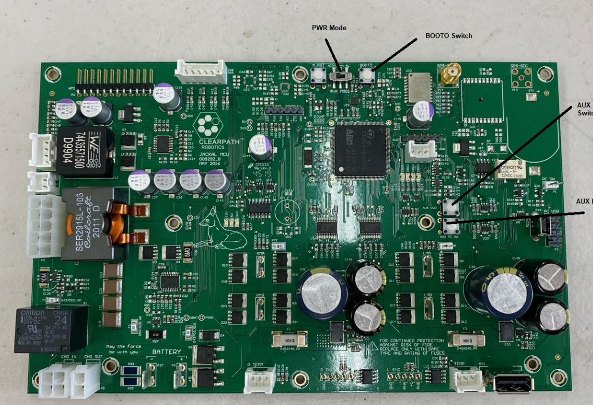

# RSP Final Project ROS2 Foxy Jackal

# Compile Instructions

Instructions for Running

```bash
mkdir -p ~/ros_jackal/src
cd ~/ros_jackal/src
git clone https://github.com/MRGonzo1/RSPFinalJackal.git
rosdep install -r --from-paths . --ignore-src --rosdistro foxy -y
export IGNITION_VERSION=fortress
colcon build
```

To run the Ignition Simulation

```bash
ros2 launch jackal_gazebo jackal_world.launch.py
```
Controling the robot, in a new terminal

```bash
ros2 run teleop_twist_keyboard teleop_twist_keyboard --ros-args --remap /cmd_vel:=/diff_drive_base_controller/cmd_vel_unstamped
```

# Usage

## Video + Pictures


https://github.com/MRGonzo1/RSPFinalJackal/assets/86250309/87675061-b54b-4744-9653-e3f4efd06ff5

Running the Simulation side by side with RViz

## Running


# Jackal Hardware

## Installing Ubuntu 20.04 and ROS Foxy
In order to upgrade the jackal robot from operating on ROS1 to ROS2, the following process was followed. The process is detailed specifically on clearpath's website (https://clearpathrobotics.com/assets/guides/foxy/jackal/ROSUpgrade.html).

The first step was upgrading the Ubuntu version present on the Jackal. This was done by downloading the downloading the server install image from the Ubuntu Official Releases (https://releases.ubuntu.com/20.04/). This image was put on a flash drive and the flash drive turned into a boot drive. This allowed for the Jackal to boot from the USB and install Ubuntu 20.04 automatically. The instructions for installing ROS2 Foxy (https://docs.ros.org/en/foxy/Installation.html) were then followed followed. 

## Adding Jackal Package Server as Source

It is necessary to configure Ubuntu's package manager to add Clearpath's package server. This is done using the following commands

```bash 
wget https://packages.clearpathrobotics.com/public.key -O - | sudo apt-key add -
sudo sh -c 'echo "deb https://packages.clearpathrobotics.com/stable/ubuntu $(lsb_release -cs) main" > /etc/apt/sources.list.d/clearpath-latest.list'
sudo apt-get update
```

Neccesary Software can then be installed using the following command

```bash
sudo apt-get install ros-foxy-jackal-desktop ros-foxy-jackal-simulator
```

## Updateing Firmware

The next step is to update the firmware on the microcontroller. Run the folowing commands

```bash
sudo apt-get update
sudo apt-get install ros-foxy-jackal-firmware
```

The microcontroller's power should be switched from Normal to ALT and the M_RST button should be pressed. These specific parts are specifed in the image below.



Then the following command can be run on the Jackal

``` bash
jackal_firmware_flash.sh
```

Once the firmware has been flashed, place the MCU back into its normal mode by switching the power switch off of ALT. The robot should power off. 

## Installing Jackal Software

In order to install the Jackal Software necessary, run the following

```bash
sudo apt-get update
sudo apt-get install python3-vcstool
mkdir -p ~/jackal_ws/src
cd ~/jackal_ws
wget https://raw.githubusercontent.com/jackal/jackal_robot/foxy-devel/dependencies.repos
vcs import src < dependencies.repos
source /opt/ros/foxy/setup.bash
rosdep install --from-paths src --ignore-src --rosdistro=$ROS_DISTRO -y
colcon build
```

If it is desired to run ROS2 on boot, the run the following commands

```bash
export ROBOT_SETUP=~/jackal_ws/install/setup.bash
ros2 run jackal_robot install
```

The Jackal software can be sourced and run manually using the following

```bash
source ~/jackal_ws/install/setup.bash
ros2 launch jackal_robot bringup.launch.py
```

## Adding Jackal Package Server as Source

It is possible that the package server was not added as a source in this process. This can be solved using the following commands

```bash 
wget https://packages.clearpathrobotics.com/public.key -O - | sudo apt-key add -
sudo sh -c 'echo "deb https://packages.clearpathrobotics.com/stable/ubuntu $(lsb_release -cs) main" > /etc/apt/sources.list.d/clearpath-latest.list'
sudo apt-get update
```

The next major step involves connecting to the network. Connecting to the Hopkins wifi requires jumping through a few hoops and we did not directly cover this. For the purpose of this guide we will skip this step and move directly to pairing the controller.

At this point, all of the software necessary is installed. It is a good idea to ensure that everything is up to date by running the following

```bash
sudo apt update && sudo apt dist-upgrade
```


## Pairing the PS4 Controller to the Jackal

There are two methods by which the PS4 controller can be paired with the Jackal. The method that worked successfully for us is documented below:
  - Ensure the 40-playstation.rules file is present in the /etc/udev/rules.d directory. If it is not this file can be found in the important_files
  - Make sure the PS4 controller is fully charged
  - Start the bluetoothctl on the Jackal using 
  ``` bash
  sudo bluetoothctl
  ```
  - Run the following command
  ```bash
  agent on
  ```
  - Put the PS4 controller into its paring mode. This can be done by holding the share button and the button with the playstation symbol until the light at the top is flashing rapidly. Once the flashing begins, the following must be done before the flashing stops.
    - Run the following command
    ```bash 
    scan on
    ```
    - Wait until a device called "wireless controller" appears. Then run the command
    ```bash
    scan off
    ```
  - Copy the MAC address of the controller, for example 70:20:84:5E:88:B5
  - Run the following commands(the connect command should be run twice)
  ```bash
  trust 70:20:84:5E:88:B5
  connect 70:20:84:5E:88:B5
  connect 70:20:84:5E:88:B5
  ```
  - The LED on the controller should have turned to a solid blue
  - Close bluetoothctl using
  ```bash 
  exit
  ```
  
  If ROS2 is running the Jackal software, the robot should be able to be controlled using the controller. This can be done by holding the left bumper (front button on the top left of the controller) as a deadman's switch. The left joystick can then be used to control the robot's motion. If it is deisred to run the robot in *turbo* mode, utilize the right bumper instead of the left, but beware, as the robot does move very fast when in this mode.
